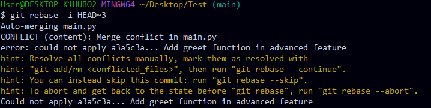

## Preguntas

### Parte 1

**¿Cúal es la salida de este comando?**

```bash
$ git log --graph --pretty-format:'%x09 %h %ar ("%an") %s'
```

Al ejecutar este comando, se muestra un gráfico donde se representa el historial de commits, incluyendo las ramas, como una secuencia de nodos (commits). La información sobre los commits se presenta al lado de los nodos y se sigue el formato dado, por ejemplo: 

```bash
*        8eeda91 4 days ago ("Yo") Subir Actividad 1, 2 y 3
```

### Parte 2

1. **¿Cómo te ha ayudado Git a mantener un historial claro y organizado de tus cambios?**

    Desde que empecé a usar Git, tengo una mejor organización en proyectos y en general, todos mis archivos. Antes de conocer Git, cambiaba de nombre las carpetas o los archivos cada vez que tenia una versión del mismo. Con Git, es más fácil de administrar las versiones por las que pasa nuestro proyecto, además de ser lo suficientemente versátil como para que no perdamos un archivo accidentalmente.

2. **¿Qué beneficios ves en el uso de ramas para desarrollar nuevas carácteristicas o corregir errores?**

    - Si hacemos una serie de cambios y queremos deshacernos de ellos, con las ramas, es más simple ya que simplemente podemos borrar la rama.
    - El hecho de tener varias ramas hace que el trabajo esté mejor estructurado y más organizado.
    - Al corregir errores, pueden suceder diferentes situaciones. Entre ellas, por ejemplo, la aparición de nuevos errores. El hecho de usar ramas hace que podamos plantear otra solución a los errores originales.

3. **Realiza una revisión final del historial de commits para asegurarte de que todos los cambios se han registrado correctamente.**
    

## Ejercicios

### 1: Manejo avanzado de ramas y resolución de conflictos
1. Crear una nueva rama para una característica

2. Modificar archivos en la nueva rama:


3. Simular un desarrollo paralelo en la rama main


4. Intentar fusionar la rama feature/advanced-feature en main:

5. Resolver el conflicto de fusión

    - `<<<<<<< HEAD`: Lo que está en la rama actual
    - `=======`: separador de los bloques en conflicto
    - `>>>>>>> feature/advanced-feature`: La rama que intentamos fusionar en la rama en la que nos encontramos

    

6. Eliminar rama fusionada


### 2: Exploración y manipulación del historial de commits
1. Ver historial detallado de commits

2. Filtrar commits por autor
3. Revertir un commit

4. Rebase interactivo y squash



5. Visualizacion gráfica del historial


### 3: Creación y gestión de ramas desde commits especificos
1. Crear una nueva rama desde un commit especifico


2. Modificar y confirmar cambios en la nueva rama

3. Fusionar los cambios en la rama principal


4. Explorar el historial despues de la fusion

5. Eliminar la rama bugfix/rollback-feature


### 4: Manipulación y restauracion de commits con git reset y git restore
1. Hacer cambios en el archivo main.py

2. Usar git reset para deshacer el commit

3. Usar git restorne para deshacer cambios no confirmados


### 5: Trabajo colaborativo y manejo de Pull Requests

1. Crear un nuevo repositorio remoto

2. Crear una nueva rama para desarrollo de una caracteristica

3. Realizar cambios y enviar la rama al repositorio 


4. Abrir un pull request

5. Revisar y fusionar el pull request


6. Eliminar la rama remota y local (Antes, hacer un git pull)


### 6: Cherry-picking y Git Stash
1. Hacer cambios en main.py y confirmarlos

2. Crear una nueva rama y aplicar el commit específico

3. Guardar temporalmente cambios no confirmados

4. Aplicar los cambios guardados (realizar otros cambios antes)

5. Revisar el historial y confirmar la correcta aplicacion de los cambios

