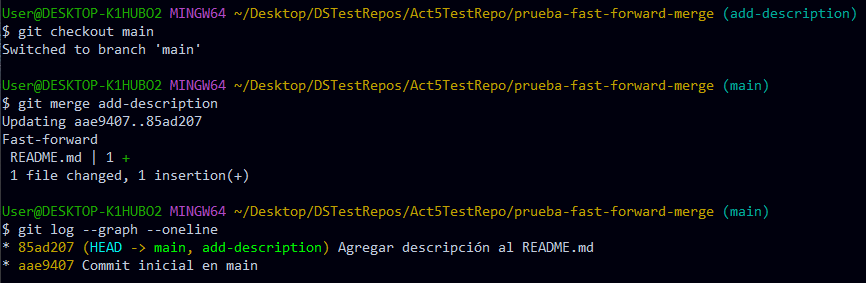
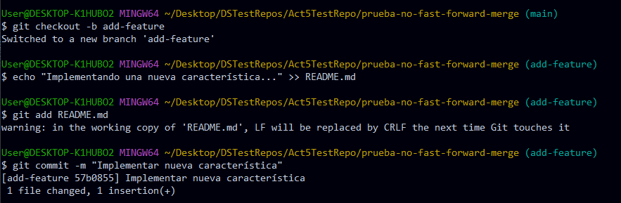
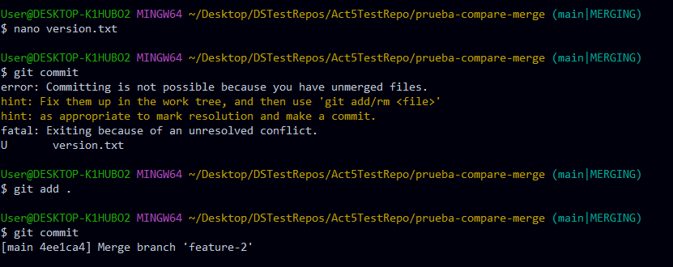
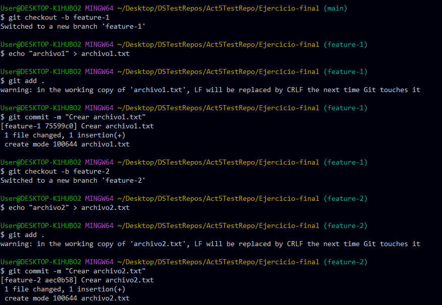

## Ejemplos

### Fusión fast-forward (git merge -ff)

1. Creacion de nuevo repositorio y archivo inicial en la rama main

2. Crear, cambiar a rama "add-description" y hacer cambios en la nueva rama commiteandolos.

3. Mostrar la estructura de commits 

### Fusión no-fast-forward (git merge --no-ff)

1. Crear un nuevo repositorio

2. Agregar archivo inicial en la rama main

3. Crear, cambiar a una nueva rama "add-feature" y hacer cambios en la nueva rama y comitearlos.

4. Cambiar a la rama main y realizar una fusión no-fast-forward

### Fusión squash (git merge --squash)

1. Crear un nuevo repositorio

2. Agregar un nuevo archivo inicial en la rama main

3. Crear, cambiar a una nueva rama "add-basic-files" y hacer algunos cambios comiteandolos.

4. Cambiar a rama main y realizar fusion squash

5. Completar squash

## Ejercicios

### Ejercicio 1

1. Clonar un repositorio Git con múltiples ramas.

    - Identifica dos ramas que puedas fusionar utilizando `git merge --ff`.
    - Haz el proceso de fusión utilizando git merge --ff.
    - Verifica el historial con git log --graph --oneline.
    

**Pregunta:** ¿En qué situaciones recomendarías evitar el uso de git merge --ff? Reflexiona sobre las desventajas de este método.

> Si queremos mantener el historial claro en el cuál podamos identificar fácilmente de donde se originan los commits. Es recomendable no usar merge -ff ya que este, no crea un merge commit, dejando en duda que commits pertenecieron a una rama en específico.
>
>También es importante tener en cuenta que si hacemos un merge fast-forward los commits son más dificiles de revertir.

2. Simula un flujo de trabajo en equipo
    - Trabaja en dos ramas independientes, creando diferentes cambios en cada una. Partiremos del caso anterior.
    - Fusiona ambas ramas con git merge --no-ff para ver cómo se crean los commits de fusión.
    - Observa el historial utilizando git log --graph --oneline.
    

**Pregunta:** ¿Cuáles son las principales ventajas de utilizar git merge --no-ff en un proyecto en equipo? ¿Qué problemas podrían surgir al depender excesivamente de commits de fusión?

> La principal ventaja es que se preserva el historial completo. Es decir, qué commits surgieron de qué ramas. Haciendo que sea más fácil interpretar como evolucionó la historia del proyecto. 
> El problema es que, al hacer un merge no-fast-forward, estamos sacrificando la "linealidad" del proyecto y con esto, un historial más "limpio" que cuando usamos otras opciones como fast-forward o rebase.

3. Crea múltiples commits en una rama
    - Haz varios cambios y commits en una rama feature.
    - Fusiona la rama con git merge --squash para aplanar todos los commits en uno solo.
    - Verifica el historial de commits antes y después de la fusión para ver la diferencia.
    
    

**Pregunta:** ¿Cuándo es recomendable utilizar una fusión squash? ¿Qué ventajas ofrece para proyectos grandes en comparación con fusiones estándar?

> Es útil cuando queremos conservar solo el resultado final y no todo el proceso que involucró. Así que podríamos usarlo cuando tenemos ramas de experimentación.
> 
> En proyectos grandes, donde la cantidad de commits es inmensa, no queremos tener más commits de los que realmente necesitamos, squash nos permite "resumir" todo el contenido de varios commits haciendo que nos ahorre el trabajo en ese caso.

### Ejercicio 2: Resolver conflictos en una fusión non-fast-forward

1. Inicializa un nuevo repositorio

2. Crea un archivo index.html y realiza un commit en la rama main:

3. Crea, cambia a una nueva rama feature-update, edita el archivo y realiza un commit en la rama feature-update

4. Regresa a la rama main y realiza una edición en el mismo archivo

5. Fusiona la rama feature-update con --no-ff y observa el conflicto

6. Abrir el archivo y solucionar el conflicto

7. Agrega el archivo corregido y completa la fusión

**Preguntas:**

- ¿Qué pasos adicionales tuviste que tomar para resolver el conflicto?
> Git automáticamente inserta comentarios en los archivos que generan conflicto. Lo que hice fue modificar el archivo de tal forma de que ya no haya conflicto. Esto se puede dar de varias formas, o mantienes los cambios de alguna de las ramas, o conservas los cambios de las dos ramas o inventas una nueva solución.

- ¿Qué estrategias podrías emplear para evitar conflictos en futuros desarrollos colaborativos?
> Evitar modificar los mismos archivos en las mismas lineas en diferentes ramas, en este caso.

### Ejercicio 3: Comparar los historiales con git log después de diferentes fusiones

1. Crea un nuevo repositorio y realiza varios commits en dos ramas

2. Fusiona feature-1 usando fast-forward

3. Fusiona feature-2 usando non-fast-forward

4. Realiza una nueva rama feature-3 con múltiples commits y fusionala con squash

5. Comparar el historial de Git
    - Historial fast-forward
    
    - Historial non-fast-forward
    
    - Historial con squash
    
    
**Preguntas:**

- ¿Cómo se ve el historial en cada tipo de fusión?
> Se ven iguales

- ¿Qué método prefieres en diferentes escenarios y por qué?
> El non-fast-forward, porque a pesar de que hace el historial menos lineal, se puede controlar su uso y no perder la trazabilidad de los commits.

### Ejercicio 4: Usando fusiones automáticas y revertir fusiones

1. Inicia un nuevo repositorio y realiza dos commits en main

2. Crea una nueva rama auto-merge y realiza otro commit en file.txt

3. Vuelve a main y realiza cambios no conflictivos en otra parte del archivo:

4. Fusiona la rama auto-merge con main

5. Reveritr la fusion y verificar el historial

**Preguntas:**

- ¿Cuándo usarías un comando como git revert para deshacer una fusión?
> Para tener un rastro en el historial. Si es que quiero que los demás vean que el commit que hice no estuvo bien.

- ¿Qué tan útil es la función de fusión automática en Git?
> Nos ahorra tiempo en solucionar problemas de fusión, que, aunque en estos archivos son simples, en proyectos mas grandes puede ser mucho más dificil de resolver manualmente.

### Ejercicio 5: Fusión remota en un repositorio colaborativo

1. Clona un repositorio remoto desde Github o crea uno nuevo

2. Crea una nueva rama de colaboración y haz algunos cambios

3. Empuja los cambios a la rama remota

4. Pull request

**Preguntas:**

- ¿Cómo cambia la estrategia de fusión cuando colaboras con otras personas en un repositorio remoto?
> Es mucho más complejo que trabajar uno solo en el repositorio. Por ello, se debe definir una estrategia en la cual cada colaborador procure no interferir o generar conflictos. Estrategias como Github flow son muy usadas hoy en día.

- ¿Qué problemas comunes pueden surgir al integrar ramas remotas?
> Un problema serio se da cuando un colaborador cambia la estructura de una rama haciendo que el commit en el que se basó otro colaborador quede en conflicto.

### Ejercicio final: Flujo de trabajo completo

1. Crea un proyecto con tres ramas: main, feature1, y feature2.

2. Realiza varios cambios en feature1 y feature2 y simula colaboraciones paralelas.

3. Realiza fusiones utilizando diferentes métodos:
    - Fusiona feature1 con main utilizando git merge --ff.
    
    - Fusiona feature2 con main utilizando git merge --no-ff.
    
    - Haz una rama adicional llamada feature3 y aplasta sus commits utilizando git merge --squash.
    
    

Se puede ver como, a simple vista, es dificil de ver en que parte se hizo el fast-forward. A diferencia de el merge non-fast-forward y squash.